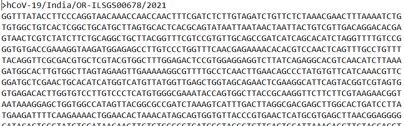

# Modeling-SARS-CoV-2-Nucleotide-Mutations

## Description
This directory comprises the folders containing the source code, data and figures for the research article: 
> Modeling-SARS-CoV-2-Nucleotide-Mutations-as-a-Stochastic-Process

## Source
This folder contains the python source code for analysing the mutation dynamics of the SARS-CoV-2 genome:

> main.py

* This python script contains the main driver code for our model and analysis

> seq.py

* This python script contains the supporting functions for pre-processing of the raw genome sequences

## Data
This folder contains the genome sequence data exported from GISAID EpiFlu / NCBI Genbank database:
* Each data file is provided in a variety of readable text formats (.fasta, .aln, .txt)
* Text header contains relevant metadata on each sample (sequence ID, collection date, country of origin)
* Text body contains a string of characters representing the corresponding RNA nucleotides (A,G,T,C)

> **Sample data file (truncated):**   
>           
> 

## Figures
This folder contains all the output figures generated from our analyses.

## How to Run the Code:
* Download the _main.py_, _seq.py_ python scripts from _source_ folder and place them in a directory. 
* Download the sequence text files from _data_ folder and place them in the same directory as the python scripts.
* Run the script _main.py_ file and check your directory for the output figures.
